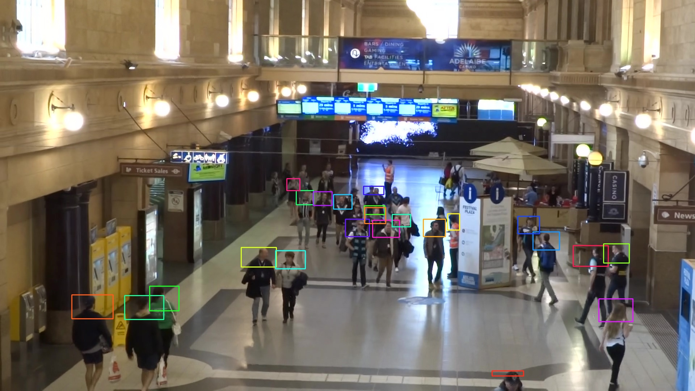
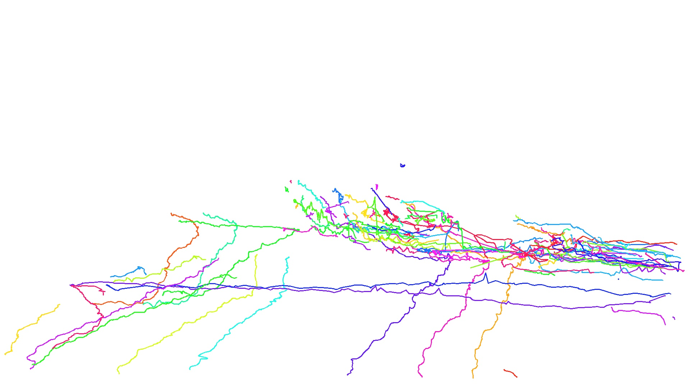

# Person Tracking

Watch the video (14sec): https://youtu.be/byiC6aOHaCo

Sample output file:
| frame_id | track_id |  x1  |  y1  |  x2  |  y2  |
|-----------|-----------|------|------|------|------|
| 1 | 1 | 198 | 815 | 312 | 881 |
| 1 | 2 | 344 | 816 | 453 | 882 |
| 1 | 3 | 1655 | 826 | 1749 | 889 |
| 2 | 1 | 200 | 814 | 314 | 881 |
| 2 | 2 | 347 | 813 | 456 | 880 |

- **frame_id** — The index of the video frame in which the detections appear.  
- **track_id** — A unique identifier assigned to each tracked object across frames.  
- **x1**, **y1**, **x2**, **y2** — The bounding box.  

Person movement trajectories:

-------------
Sample input used from MOT20 dataset https://motchallenge.net/data/MOT20Det/
